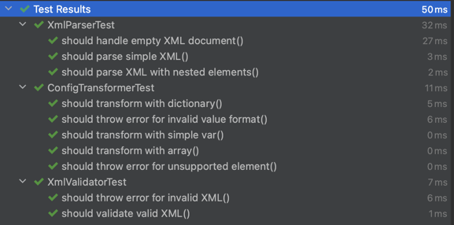

# XML to Custom Configuration Language Converter

## Overview

This project is a simple program that transforms an XML file into a custom configuration language. The program reads an XML file, validates and parses it, and then converts its structure into a configuration language format designed for this application. The tool supports various elements such as variables, arrays, and dictionaries.

## Features

- **XML Parsing**: Parses an XML file and converts it into a hierarchical structure.
- **Configuration Generation**: Transforms XML elements into a custom configuration language format.
- **Validation**: Checks the validity of the XML file and handles errors gracefully.
- **Support for Nested Structures**: Handles nested arrays and dictionaries within the XML.

## Requirements

- **Kotlin** 1.8+
- **Gradle** (for building and running the project)
- **JUnit 5** (for testing)
- **MockK** (for mocking in tests)

## Setup and Installation

1. Clone the repository:

   ```bash
   git clone https://github.com/yourusername/xml-to-configml.git
   ```

2. Navigate to the project directory:

   ```bash
   cd xml-to-configml
   ```

3. Build the project using Gradle:

   ```bash
   ./gradlew build
   ```

4. Run the program:

   ```bash
   ./gradlew run --args="path/to/your/file.xml"
   ```

   Replace `"path/to/your/file.xml"` with the path to your XML file.

## Usage

The program reads an XML file and outputs the configuration language to the console. For example:

**Sample XML file (`example.xml`):**

```xml
<root>
    <var name="username">"Alice"</var>
    <var name="age">30</var>
    <array>
        <item>1</item>
        <item>2</item>
        <item>3</item>
    </array>
    <dictionary>
        <entry name="city">"New York"</entry>
        <entry name="zipcode">10001</entry>
        <entry name="languages">
            <array>
                <item>"English"</item>
                <item>"Spanish"</item>
            </array>
        </entry>
    </dictionary>
</root>
```

**Output:**

```
var username "Alice";
var age 30;
(1 2 3)
{
    city: "New York",
    zipcode: 10001,
    languages: ("English" "Spanish")
}
```

## Project Structure

```
src/
└── com/
    └── yandexbrouser/
        └── xmltoconfigml/
            ├── Main.kt
            ├── parser/
            │   ├── XmlParser.kt
            │   └── XmlElement.kt
            ├── transformer/
            │   ├── ConfigTransformer.kt
            ├── validator/
            │   ├── XmlValidator.kt
```

## Testing

Unit tests are written using **JUnit 5** and **MockK** for mocking dependencies. The tests cover all major components including the XML parsing, transformation logic, and validation processes.

To run the tests:

```bash
./gradlew test
```

### Test Results

Below is an image showcasing the test results:


